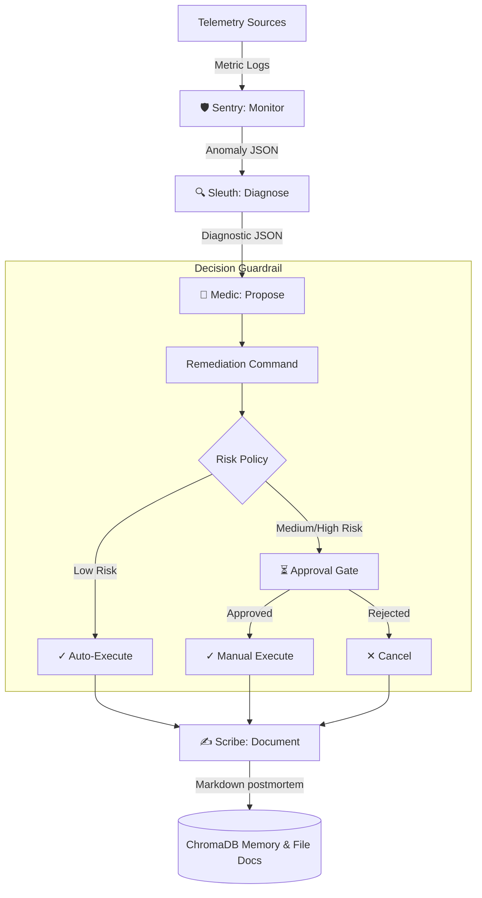

# 🛡️ Aegis: Autonomous Agentic MLOps Command

Aegis is an autonomous, multi-agent operations platform designed to close the loop between anomaly detection, root-cause diagnosis, and remediation across production machine learning stacks (model-serving, GPU infrastructure, and data pipelines). 

Aegis acts where it is safe to do so automatically, and coordinates a crisp human-in-the-loop approval handoff where it isn't.

---

## 🏗️ Architecture Blueprint

Aegis is composed of four cooperating AI agents built on top of the **Google Agent Development Kit (ADK)** and powered by **Gemini 2.5 Flash**:



### The 4 Cooperating Agents

1. **🛡️ Sentry (Monitoring Agent)**: Continuously evaluates system telemetry (latency, error rates, GPU utilization, and data drift scores). It computes deviation from historical baselines (with directionality intelligence) and creates structured anomalies.
2. **🔍 Sleuth (Diagnostic Agent)**: Correlates metrics, logs, and deployment events across services when Sentry flags an anomaly. It queries ChromaDB vector store for historical occurrences to deliver a root-cause hypothesis with a confidence score.
3. **💊 Medic (Remediation Agent)**: Proposes targeted interventions (e.g. pod restarts, model version rollbacks, queue workload rebalancing) and drafts exact command strings.
4. **✍️ Scribe (Reporting Agent)**: Generates a complete, publication-quality incident postmortem report in Markdown format capturing timelines, root cause findings, actions taken, and preventative recommendations.

---

## 📂 Project Directory Structure

```directory
aegis/
├── agents/                      # Core Multi-Agent Logic (ADK)
│   ├── sentry/                  # Monitoring metrics & baseline tools
│   ├── sleuth/                  # Diagnostic log correlation & deploy lookups
│   ├── medic/                   # Remediation proposing & risk tiering policy
│   ├── scribe/                  # Markdown report generator & ChromaDB archiver
│   └── memory/                  # Shared vector store (ChromaDB) & Pydantic schemas
├── backend/                     # FastAPI & gRPC Service Layer
│   ├── api/                     # REST routers (incidents, approvals, metrics)
│   ├── db/                      # SQLite persistence (SQLAlchemy models & sessions)
│   └── grpc_server/             # gRPC streaming server & protobuf schemas
├── simulator/                   # Failure-Injection Harness
│   ├── failure_scenarios/       # Out-of-the-box scenario registries
│   ├── metrics_generator.py     # Realistic telemetry time-series generator
│   └── mock_inference_service.py # FastAPI ML service simulation
├── frontend/                    # Vite + React (TypeScript) Console Dashboard
│   ├── src/components/          # Telemetry charts, trace console, timelines, modals
│   └── src/hooks/               # Real-time Server-Sent Events (SSE) stream hooks
├── infra/                       # Containerized infrastructure
│   ├── Dockerfile.backend       # Multi-stage optimized builder backend container
│   ├── Dockerfile.frontend      # Multi-stage nginx-served frontend container
│   ├── Dockerfile.simulator     # Lightweight simulator container
│   └── docker-compose.yml       # Production-grade service orchestrator
└── tests/                       # Automated testing suite (unit + integration)
```

---

## ⚡ Quick Start

### 1. Prerequisites & Environment Setup
Ensure you have Python 3.11+ and Node.js 20+ installed. Clone the repository and configure your environment key:

```bash
# Clone the repository
git clone https://github.com/Debddj/Aegis.git
cd aegis

# Create and configure .env in project root
cp .env.example .env
# Edit .env and paste your GOOGLE_API_KEY
```

Using `uv` for lightning-fast environment setup:
```bash
# Install uv if missing
pip install uv

# Initialize environment and install dependencies
uv venv
source .venv/bin/activate  # Or .venv\Scripts\activate on Windows
uv pip install -e ".[dev]"
```

### 2. Run the Stack (Docker Compose)
Aegis is fully containerized. Start the entire system in one command using the `-p aegis` namespace to prevent conflicts with other projects named `infra`:
```bash
docker compose -p aegis -f infra/docker-compose.yml up -d
```
This launches the following services in detached mode:
- **Simulator** on `http://localhost:8100` (Mock ML service)
- **FastAPI Backend** on `http://localhost:8000` (Core REST APIs + SSE Event Streams)
- **gRPC Server** on `port 50051` (Streaming metrics/traces)
- **Vite React Console** on `http://localhost:5173` (Obsidian-themed operator dashboard)

You can check container status and logs with:
```bash
# Get container status and port mappings
docker compose -p aegis -f infra/docker-compose.yml ps

# Follow logs from the backend
docker logs -f aegis-backend-1
```

---

## 🧪 Testing and Quality Gates

Aegis enforces a strict quality and lint standard. To run the complete verification suite:

```bash
# Run unit and integration tests (Real Gemini API validation)
.venv/Scripts/pytest -v

# Run the Ruff linter check
.venv/Scripts/ruff check .
```

---

## 🎮 Failure Injection Demo Guide

You can test Aegis's autonomous loops using the built-in CLI to inject simulated production failures:

```bash
# Inject a latency spike (caused by bad model rollout)
python -m simulator.cli inject latency_spike

# Inject GPU Out-of-Memory / memory fragmentation
python -m simulator.cli inject gpu_oom

# Inject data distribution drift (PSI exceeds baseline)
python -m simulator.cli inject data_drift

# Inject cascading multi-system collapse
python -m simulator.cli inject cascading_failure

# Reset simulator back to normal healthy baseline
python -m simulator.cli inject reset
```

### Watch the Command Console
Once a failure is injected:
1. Open `http://localhost:5173/` in your browser.
2. Watch the **Telemetry Streams** area chart spike instantly.
3. Observe the **Live Agent Execution Trace** chain light up sequentially as `Sentry` → `Sleuth` → `Medic` → `Scribe` execute.
4. Review Scribe's **Markdown Postmortem** detailing the incident context, diagnosis, and remediation results.
5. If the proposed action is **Medium/High Risk** (e.g. model rollback), Aegis halts and triggers the **Human Approval Gate Modal** asking for operator permission before executing. Low-risk actions (e.g. pod restarts) are resolved autonomously.

---

## 🛡️ Security & Remediation Guardrails
 
 To prevent unauthorized or destructive model mutations, Aegis implements a strict risk policy:
 - **Active Background Monitoring**: An automated loop checks metrics in the simulator every 5 seconds. If an anomaly threshold is breached (severity $\ge 0.70$), the multi-agent pipeline is run autonomously.
 - **Auto-execution is restricted** to deterministic low-risk commands (e.g. `restart_pod`, `rebalance_queue`).
 - **All medium/high risk commands** (e.g. `rollback_model`, `scale_down_cluster`) are locked behind an operator approval gate.
 - **Administrative Protection**: The `/api/agents/approve/{incident_id}` route enforces a Bearer Token validator checking requests against the `AEGIS_ADMIN_TOKEN` config (defaults to `aegis-secure-token-2026`).
 - **Remediation Sandboxing**: Remediation commands are stripped from the LLM tool context to prevent jailbreaking; they are parsed and executed programmatically by the orchestrator *only* after passing the security gate.

